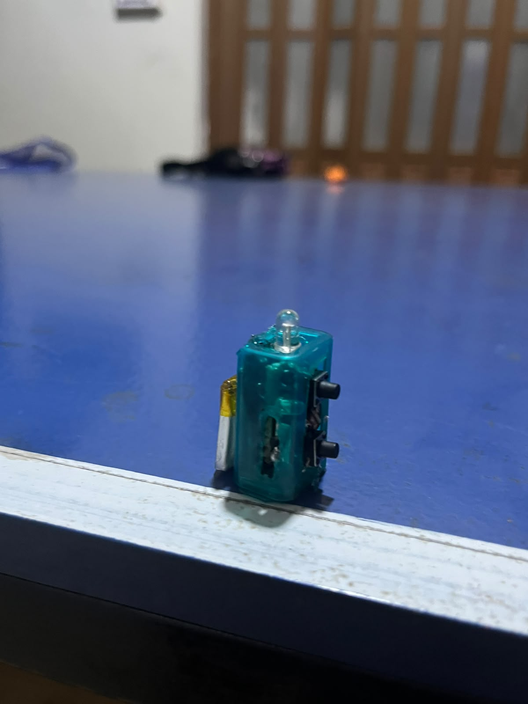

# Tacmote – ATtiny85 IR Remote

Tacmote is a compact universal preprogrammmed IR remote housed inside a tictac box.

## 🎥 Demo

Watch Tacmote in action:

[▶️ Watch the Demo](https://www.youtube.com/shorts/zra1wGCjjW4)

## Overview

I wanted to use a Tic Tac box as the enclosure for a small electronics project because of its compact size and portability. So I decided to build Tacmota an IR remote controlling my TV and air conditioner from a single device, eliminating the need for me to carry multiple remotes.

## How It Works

Tacmote uses an attiny85 ic microcontroller that runs a custom firmware where you can store the uniuqe 112 bit Pulse Distance IR protocol of the remote you want to replicate.When the user presses the designated pushbutton the IRremote transmits the corresponding IR code, replicating the orginal remote. 

## Hardware

The project consists of:

* ATtiny85 ic microcontroller
* Infrared LED
* Two push buttons
* Indication LED
* 120 mAh rechargeable Lipo battery
* TP4056 USB C charging module
* spdt slide switch
* Tic Tac box enclosure(link: https://www.amazon.com/Tic-Tac-Strawberry-total-GRAMS/dp/B0CLJMQFFH)

## Pinout

| ATtiny85 Pin | Function |
|--------------|----------|
| PB0 (Pin 5) | IR LED |
| PB2 (Pin 7) | Status LED |
| PB3 (Pin 2) | TV Push Button |
| PB4 (Pin 3) | AC Push Button |

## Programming

Tacmote is programmed using the Arduino IDE and an Arduino Uno configured as an ISP programmer.

**Required software:**

* Arduino IDE
* ATTinyCore by Spence Konde
* IRremote library

**Board settings:**

* Board: ATtiny25/45/85
* Chip: ATtiny85
* Clock: 8 MHz Internal
* Programmer: Arduino as ISP

**Obtaining and customizing IR values**

To capture IR commands from an existing remote:

1. Connect an IR receiver (such as a VS1838B or TSOP38238) to an Arduino.
2. Install the **IRremote** library.
3. Upload the `ReceiveDump` example included with the library.
4. Point the original remote at the receiver and press the button you wantto replicate.
5. Copy the decoded protocol and raw data into the Tacmote firmware.
6. Reprogram the ATtiny85 using **Upload Using Programmer**.

For televisions and other standard remotes, the decoded protocol is usually sufficient. For many ACs the complete raw Pulse Distance data should be used, as these remotes transmit the entire device state in each command.

## Current Features

* Compact and lightweight design
* Transmits a prerecorded air-conditioner IR command
* Programable for new IR signals
* Rechargeable via USB-C

